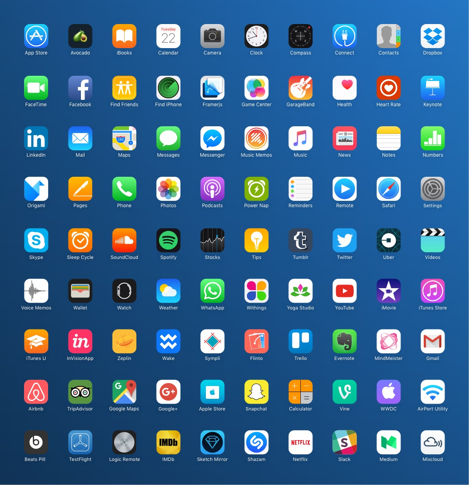

# 83 vectorized iOS popular apps (iPhone)
Sketch vectorized template of 83 popular iOS apps. This project is not made for commercial use. For further details, read the [discalimer](#discalimer) and [Copyright & License](#copyright-and-license)
Created by [Jonas Bröms](https://twitter.com/jonasbroms).

## Table of contents
* [File formats](#file-formats)
* [Overall Structure](#overall-structure)
* [Graphical Assets](#graphical-assets)
* [Shared styles structure](#shared-styles-structure)
* [What's new](#whats-new)
* [Bugs](#bugs)
* [Future improvements](#future-improvements)
* [Version](#version)
* [Creator](#creator)
* [Special thanks to](#special-thanks-to)
* [Copyright and license](#copyright-and-license)
* [Disclaimer](#disclaimer)

## File formats
Following file formats are included within this template:
* Documentation (README.md)
* Sketch file
* PNG (60x60px, 76x76px, 80x80px, 120x120px, 167x167px, 180x180px)
* SVG

## Text Styles Structure
```
Symbol/
└── iOS/
    └── iPhone 6/
        └── App badges/
            ├── Label
            └── Calendar
                ├── Day
                └── Date
```

## Overall Symbol Structure
```
Symbol/
└── iOS/
    └── iPhone 6/
        └── App badges/
            └── App
                └── Large
                    ├── (K) App slice
                    ├── (O) App Group - App specific shapes
                    └── (Aa) App label
```

## App Badges
* [AirPort Utility](https://itunes.apple.com/us/app/airport-utility/id427276530?mt=8)
* [App Store](https://www.apple.com/appstore)
* [Avocado](http://avocode.com/)
* [iBooks](http://www.apple.com/ibooks/)
* [Beats Pill+](https://itunes.apple.com/us/app/beats-pill+/id1005829608?mt=8)
* Calculator
* Calender
* Camera
* Clock
* Compass
* Connect
* Contacts
* [Dropbox](https://itunes.apple.com/us/app/dropbox/id327630330?mt=8)
* [FaceTime](http://www.apple.com/ios/facetime/)
* [Facebook](https://itunes.apple.com/en/app/facebook/id284882215?mt=8)
* [Find Friends](https://itunes.apple.com/en/app/find-my-friends/id466122094?mt=8)
* [Find iPhone](https://itunes.apple.com/en/app/find-my-iphone/id376101648?mt=8)
* [Framerjs](http://framerjs.com/)
* [Flinto](https://www.flinto.com/mac)
* [Game Center - WIP](https://developer.apple.com/game-center/)
* [GarageBand](https://itunes.apple.com/en/app/garageband/id408709785?mt=8)
* [Health](http://www.apple.com/ios/health/)
* [Heart Rate](https://itunes.apple.com/us/app/sleep-cycle-heart-rate/id813503318?mt=8)
* [Keynote](http://www.apple.com/ios/keynote/)
* [iTunes Store](https://itunes.apple.com/en/app/apple-store/id375380948?mt=8)
* iTunes U
* [LinkedIn](https://itunes.apple.com/en/app/linkedin/id288429040?mt=8)
* [Logic Remote - WIP](https://itunes.apple.com/us/app/logic-remote/id638394624?mt=8)
* Mail
* [Maps](http://www.apple.com/ios/maps/)
* [Messages](http://www.apple.com/ios/messages/)
* [Messenger](https://itunes.apple.com/us/app/messenger/id454638411?mt=8)
* [Music Memos - WIP](http://www.apple.com/music-memos/)
* [Music - WIP](http://www.apple.com/music/)
* [News](http://www.apple.com/news/)
* Notes
* [Numbers](http://www.apple.com/ios/numbers/)
* [Origami](https://itunes.apple.com/us/app/origami-live-design-prototyping/id942636206?mt=8)
* [Pages](http://www.apple.com/ios/pages/)
* Phone
* [Photos](http://www.apple.com/ios/photos/)
* [Podcast](https://www.apple.com/support/ios/podcasts/)
* [Power Nap](https://itunes.apple.com/us/app/sleep-cycle-power-nap/id813493308?mt=8)
* Reminders
* Remote
* Safari
* Settings
* [Sympli](https://sympli.io/)
* [Skype](https://itunes.apple.com/en/app/skype-for-iphone/id304878510?mt=8)
* [Sleep Cycle](https://itunes.apple.com/en/app/sleep-cycle-alarm-clock/id320606217?mt=8)
* [Snacpchat](https://itunes.apple.com/en/app/snapchat/id447188370?mt=8)
* [Soundcloud](https://itunes.apple.com/us/app/soundcloud-music-audio/id336353151?mt=8)
* [Spotify](https://itunes.apple.com/cy/app/spotify-music/id324684580?mt=8)
* Stocks
* [TestFlight](https://itunes.apple.com/cy/app/testflight/id899247664?mt=8)
* [Tips](https://tips.apple.com/en-us/ios/iphone)
* [Tumblr](https://itunes.apple.com/us/app/tumblr/id305343404?mt=8)
* [Twitter](https://itunes.apple.com/en/app/twitter/id333903271?mt=8)
* [Uber](https://itunes.apple.com/us/app/uber/id368677368?mt=8)
* [Videos](http://www.apple.com/ios/videos/)
* Voice Memos - WIP
* Wallet
* Weather
* [WhatsApp](https://itunes.apple.com/cy/app/whatsapp-messenger/id310633997?mt=8)
* [Withings](https://itunes.apple.com/us/app/health-mate-steps-tracker/id542701020?mt=8)
* [Wake](https://wake.io/)
* [Yoga Studio](https://itunes.apple.com/us/app/yoga-studio/id567767430?mt=8)
* [YouTube](https://itunes.apple.com/cy/app/youtube/id544007664?mt=8)
* [Zeplin](https://zeplin.io/)

## What's new
* Every App badge is made into a symbol + structure
* Shared Styles + structure
* Text Styles + structure
* Documentation

## Bugs
* Haven't been able to install SF Font Ultra thin and there fore haven't made the Calender App Badge correctly.
* iWatch wristband needs to be aligned according to the real thing.
* Podcast app is more alike the MacOS version then the iOS version.

## Future improvements
* Update some of the logotypes
* Make optimizations to the whole framework
* Make it more lightweight so it runs smoother

## Version
0.1 Alpha

## Creator
**Jonas Bröms**
* [Twitter](https://twitter.com/jonasbroms)
* [GitHub](https://github.com/bromso)

## Special thanks to
To all these great apps included in this document!

## Copyright and license
Graphical assets, files, code and documentation released under the [MIT](). Docs released under [Creative Commons](https://creativecommons.org/licenses/by/3.0/).

## Disclaimer
While I have redrawn and shared these assets for the benefit of the design community, I do not own any of the underlying products, logotype or user interface designs. By accessing these assets, you agree to obtain all necessary permissions from the underlying rights holders and/or adhere to any applicable brand use guidelines before using them. I disclaims all express or implied warranties with respect to these assets, including non-infringement of intellectual property rights.
